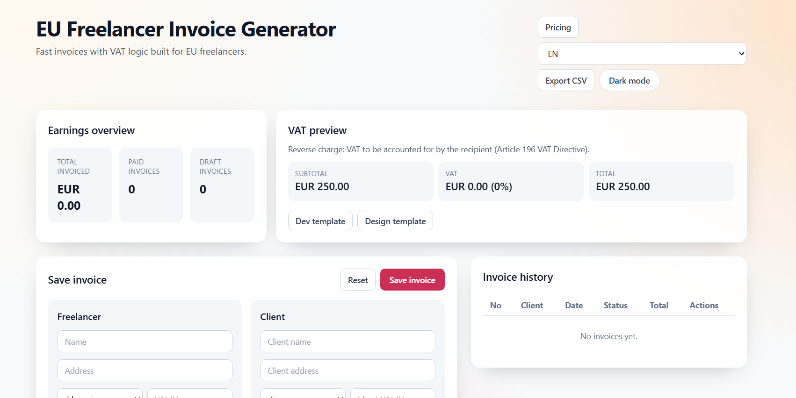

# EU Freelancer Invoice Generator


Professional EU-compliant invoicing for freelancers, developers, designers, and solo businesses.

Create invoices in seconds, apply the correct VAT logic automatically, export PDF invoices, and track revenue from a clean dashboard.

## App Preview



## Live Demo

After GitHub Pages deployment finishes, your public demo will be available at:

https://adrijan-petek.github.io/EU-Freelancer-Invoice-Generator/

To enable it the first time in GitHub:

1. Open repository Settings > Pages
2. Set Source to GitHub Actions
3. Push to main (or run the Deploy to GitHub Pages workflow manually)

## Why This Project

EU freelancers often struggle with VAT complexity and expensive accounting tools. This app is a lightweight alternative focused on the practical parts you need every day.

## Core Features

- Professional invoice creation
- EU VAT handling logic
- Same EU country: applies your standard VAT rate
- Different EU country: reverse charge with 0 percent VAT and legal note
- Outside EU: export of services with 0 percent VAT note
- Automatic invoice numbering in the format INV-YYYY-0001
- Edit, duplicate, and delete invoices
- PDF invoice export
- CSV export for accounting
- Earnings overview dashboard
- Freelancer profile persistence in browser
- Mobile responsive UI
- Dark mode toggle
- Multi-language UI: English, German, Slovenian

## Tech Stack

- Next.js 14 (Pages Router + API routes)
- React + TypeScript
- Tailwind CSS
- Local JSON storage at data/invoices.json
- jsPDF for PDF generation

## Project Structure

```text
.
├── components
├── data
├── lib
├── pages
│   └── api
├── styles
├── utils
├── package.json
└── README.md
```

## VAT Logic

Business logic is implemented in lib/vat.ts and lib/calculations.ts.

- Domestic EU invoice: apply standard VAT
- Cross-border EU B2B invoice: reverse charge, 0 percent VAT, VAT directive note
- Non-EU client invoice: 0 percent VAT export logic

Note: Tax regulations vary by country and business setup. This tool helps automate common cases but is not legal advice.

## API Endpoints

- GET /api/invoices: List invoices
- POST /api/invoices: Create invoice
- PUT /api/invoices?id={id}: Update invoice
- DELETE /api/invoices?id={id}: Delete invoice

## Local Development

### 1) Install dependencies

```bash
npm install
```

### 2) Start dev server

```bash
npm run dev
```

Open http://localhost:3000

### 3) Build for production

```bash
npm run build
npm run start
```

## Data Storage

- Database file: data/invoices.json
- Created automatically on first run
- Ignored in git to avoid committing private invoice data
- On GitHub Pages demo, invoices are saved in browser localStorage because API routes are not available on static hosting

## GitHub Upload Steps

If you are starting fresh:

```bash
git init
git add .
git commit -m "Initial commit"
git branch -M main
git remote add origin https://github.com/Adrijan-Petek/EU-Freelancer-Invoice-Generator.git
git push -u origin main
```

If remote already exists, run:

```bash
git remote set-url origin https://github.com/Adrijan-Petek/EU-Freelancer-Invoice-Generator.git
git push -u origin main
```

## Pro Version Preparation

Suggested free plan:

- Invoice creation
- VAT logic
- PDF and CSV export

Suggested Pro plan at 5 EUR per month:

- Cloud sync and backups
- Multi-currency support
- Advanced VAT automation and country presets
- Client management and saved templates
- Export accounting reports

## Payment and Revenue Setup (PayPal)

To start charging customers:

1. Create or upgrade to a PayPal Business account.
2. Create subscription products in PayPal for monthly plans.
3. Add webhook handling in this app for subscription events.
4. Restrict Pro features based on active subscription state.
5. Add a pricing page and checkout buttons.

Current app support:

- Direct PayPal subscription button on the pricing page.
- Optional checkout links for Starter and Pro.

Add the following variables to .env.local:

```env
NEXT_PUBLIC_PAYPAL_CLIENT_ID=your_paypal_client_id
NEXT_PUBLIC_PAYPAL_PLAN_ID=your_subscription_plan_id
NEXT_PUBLIC_PAYPAL_STARTER_URL=https://your-paypal-link
NEXT_PUBLIC_PAYPAL_PRO_URL=https://your-paypal-link
```

Recommended: keep payment credentials in environment variables and never commit secrets.

## Roadmap

- Supabase mode for cloud invoice sync
- Team workspaces
- Branded invoice templates
- Public client payment links
- Stripe and PayPal dual gateway support

## License

You can add MIT license for open-source distribution, or keep source private for commercial SaaS usage.
